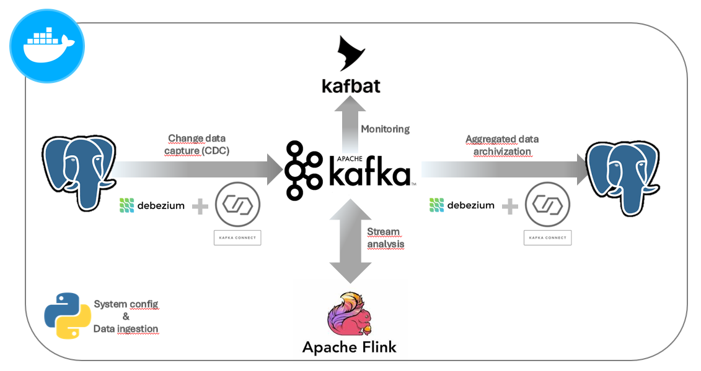

# 🔄 Change Data Capture System with Real-Time Analytics

Table of contents:  
1. [Overview](#-overview)
1. [Features](#-features)
1. [Architecture](#️-architecture) 
1. [Key Technologies](#-key-technologies)
1. [Steps to Run This Project](#-steps-to-run-this-project)

## 📖 Overview
This project is a **Change Data Capture (CDC) System** designed to demonstrate real-time data processing and analytics capabilities. It leverages streaming technologies to monitor database changes, transform the data, and provide insights in real time.

The system highlights data engineering concepts such as event-driven architectures, fault tolerance, and latency management using watermarks. It is built to handle real-world scenarios efficiently and effectively.
 


---

## ✨ Features
- 📡 **Real-Time Data Capture**: Monitors changes in a PostgreSQL database and streams them as events.
- ⚙️ **Event Processing with Flink**: Processes and analyzes data streams, applying transformations and basic analytics.
- 🛡️ **Fault Tolerance**: Uses Kafka's three-broker setup to ensure high availability.
- 🔍 **Custom Health Checks and Scheduling**: Enhances Docker Compose orchestration reliability.
- 📊 **Real-Time Dashboards**: Streams processed data back to the database for visualization.

---

## 🛠️ Architecture
1. **Data Ingestion**: A Python worker ingests data into a PostgreSQL database and configures Kafka Connect, when it starts up.  
2. **Change Data Capture**: Debezium, integrated with Kafka Connect, converts database changes into Kafka events.  
3. **Stream Processing**: Apache Flink processes Kafka events, applying transformations and analytics.  
4. **Output Pipelines**: The processed data is sent back to Kafka topics and sinked in a database for dashboard consumption.  


---

## 🚀 Key Technologies
- **PostgreSQL**: Initial and final data storage.  
- **Kafka & Kafka Connect**: Core of the event streaming platform.  
- **Debezium**: Change Data Capture integration.  
- **Apache Flink**: Stream processing and real-time analytics.  
- **Docker Compose**: Orchestration of all system components.  
- **Python**: Custom scripts for data ingestion and configuration.  

---

## 🧰 Steps to Run This Project
1. **Fork/clone this repository.** The smallest GitHub Codespace is enough to handle this project.  
2. **Create a copy of _sample.env_ as _.env_ in the root folder.** Adjust setup in newly created file if needed.
   ```bash
   cp sample.env .env
   ```
3. **Download [Debezium connector](https://debezium.io/releases/3.0/#compatibility) files** (Postgres Source and JDBC Sink).
   ```bash
   ARCHIVE=debezium-connector.tar
   OUTPUT_FOLDER=$(pwd)/jars

   URL=https://repo1.maven.org/maven2/io/debezium/debezium-connector-jdbc/3.0.2.Final/debezium-connector-jdbc-3.0.2.Final-plugin.tar.gz
   curl -o "$ARCHIVE" "$URL"
   tar -xzvf $ARCHIVE -C $OUTPUT_FOLDER && rm $ARCHIVE

   URL=https://repo1.maven.org/maven2/io/debezium/debezium-connector-postgres/3.0.2.Final/debezium-connector-postgres-3.0.2.Final-plugin.tar.gz
   curl -o "$ARCHIVE" "$URL"
   tar -xzvf $ARCHIVE -C $OUTPUT_FOLDER && rm $ARCHIVE
   ```
4. **Download Flink's [Upsert Kafka SQL connector](https://nightlies.apache.org/flink/flink-docs-release-1.20/docs/connectors/table/upsert-kafka/):**
   ```bash
   URL=https://repo.maven.apache.org/maven2/org/apache/flink/flink-sql-connector-kafka/3.3.0-1.20/flink-sql-connector-kafka-3.3.0-1.20.jar
   curl -o "$ARCHIVE" "$URL"
   tar -xzvf $ARCHIVE -C $OUTPUT_FOLDER && rm $ARCHIVE
   ```
5. **Download sample dataset** to stream and join:  
   Application was prepared for [Taxi data](https://www.nyc.gov/site/tlc/about/tlc-trip-record-data.page), particularly [yellow taxi data](https://d37ci6vzurychx.cloudfront.net/trip-data/yellow_tripdata_2024-01.parquet) with [taxi zones](https://d37ci6vzurychx.cloudfront.net/misc/taxi_zone_lookup.csv).

6. **Build the Python worker** in the root folder:
   ```bash
   docker build -t worker -f src/worker/Dockerfile .
   ```
7. **Run the Docker Compose file:**
   ```bash
   cd /workspaces/local-data-streaming/docker
   docker-compose --env-file=../.env up -d
   ```
   The first run will take significantly longer due to image pulling. Subsequent runs take approximately 3 minutes to complete due to Kafka Connect startup.

8. **Access services through port forwarding:**

   | Port   | Service           |
   |-------:|------------------:|
   | 80     | pgAdmin           |
   | 8080   | KafkaUI           |
   | 8081   | Flink Dashboard   |
   | 8081   | Kafka Connect     |

9. If any Flink sequence modification is required, Flink client can be started with snippet:
```bash
cd /workspaces/local-data-streaming/docker
docker compose run flink-client 
```

---

## 📅 Future Improvements
- 📈 **Showcase Dashboards**: Examples of real-time insights and data visualizations.  
- 🧮 **Enhanced Analytics**: Incorporating advanced analytical features for deeper insights.  

---

## 🧠 Lessons Learned
- ⚙️ Managing Docker Compose for complex systems required custom health checks and container scheduling for reliability.  
- 🕒 Working with streaming data highlighted the importance of watermarks and event-time handling for accurate results.  
